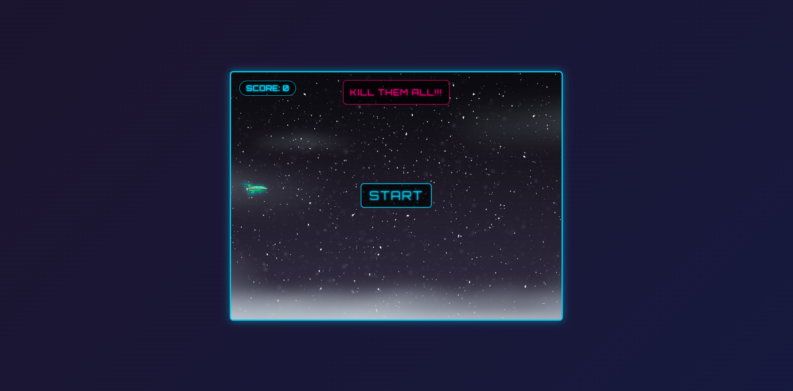

# 🚀 Space Shooter

**Space Shooter** is a simple arcade-style shooting game built with vanilla JavaScript, HTML, and CSS. Control your spaceship and destroy incoming enemies to earn points!

<p align="center">
  
</p>

---

## 🎮 Live Demo

👉 [Play it now](https://gustavo-zamai.github.io/space-shooter/) 🌐 👈

## 🎮 Controls

- ⬅️ ➡️ — Move left and right  
- ⬆️ ⬇️ — Move up and down  
- 🔫 `Spacebar` — Shoot bullets

## 🛠️ Technologies Used

- **HTML5** – Structure of the game page  
- **CSS3** – Styling and animations  
- **JavaScript (Vanilla)** – Game logic and interactions

## 📦 Project Structure

```bash
space-shooter/
├── .github/
├── image/
├── README.md     # This file 😁
├── index.html    # Game UI
├── style.css     # Visual styling
└── script.js     # Game logic
```

## 🚀 How to Run Locally

#### 1. Clone the repository:
```bash
git clone https://github.com/Gustavo-Zamai/space-shooter.git
cd space-shooter
```
#### 2. Open index.html in your browser:

```bash
start index.html      # On Windows
# or
open index.html       # On macOS
# or
xdg-open index.html   # On Linux
# No installation required — it's a fully static front-end game!
```

## 📌 Features
- Keyboard-controlled spaceship
 
- Bullet shooting mechanics
 
- Enemies appearing on screen
 
- Collision detection
 
- Score system

## 🧠 Learning Goals
- This project helps you practice:
 
- DOM manipulation
 
- Event handling (keydown, keyup)
 
- Animation with setInterval or requestAnimationFrame

- Game loop structure

## 📄 License
- This project is under MIT license, open for learning purposes. Feel free to fork and build on top of it.
